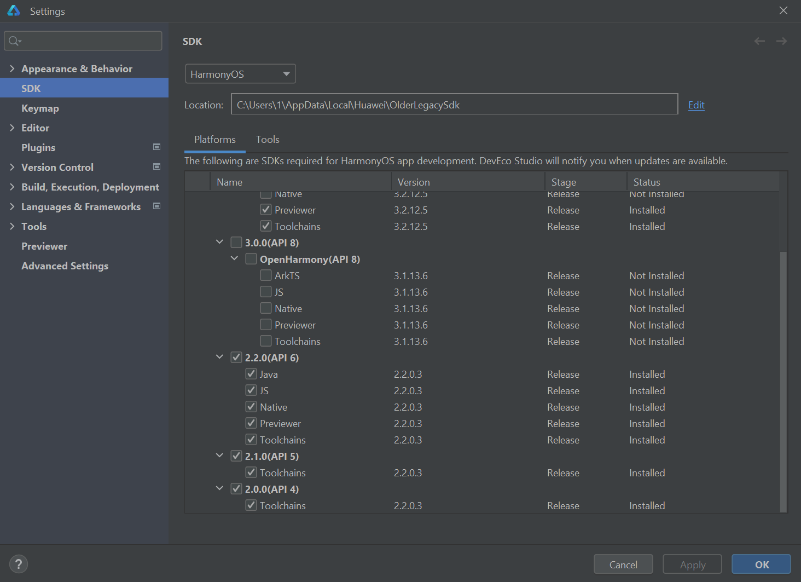
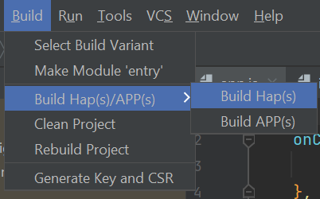

## Choose language
**[[en]](README.en.md)** [[ru]](README.ru.md)

## Table of Contents

  
Click me

  - [Choose language](#choose-language)
  - [Table of Contents](#table-of-contents)
  - [Introduction](#introduction)
  - [Before you start](#before-you-start)
  - [Step by step guide](#step-by-step-guide)
    - [1. Get your huawei account approved.](#1.-get-your-huawei-account-approved.)
    - [2. Download software](#2.-download-software)
      - [1. DevEco Legacy IDE](#1-deveco-legacy-ide)
      - [2. HarmonyOS SDK 6.0](#2-harmonyos-sdk-60)
      - [3. Huawei DevEco Assistant (HDEA)](#3-huawei-deveco-assistant-hdea)
      - [4. Huawei Health](#4-huawei-health)
    - [3. Get your licences](#3-get-your-licences)
    - [4. Make and transfer the build](#4-make-and-transfer-the-build)
  - [Examples and references](#examples-and-references)
- [Summary](#summary)
- [Troubleshooting](#troubleshooting)

## Introduction
This is a comprehensive guide on how to setup your environment and start creating apps for your huawei litewearable.

This repo was created because I **spent way too much** time to setup and get all the right info to even start the development, let alone create anything. I really, really wanted to make an app for my Huawei Watch GT 3 or better know as <ins>litewearable with sdk 6.0</ins> device. We will get to it, don't worry.

If you think that you are fancy and know everything or you are somewhere close and reffered to this guide just to check if you missed something you can skip to the [summary](#summary) part of this guide.

## Before you start
+ The guide is WIP, so be considered it might not work for you and your specific problem. In this case check out the internet.
+ It is windows and anroid only. While it's possible to do on MacOS, linux and iphone, I didn't do it. In theory you can reproduce all the steps.
+ This is a guide on how to create apps for huawei litewearables that use sdk 6.0 and lower.

## Step by step guide
### 1. Get your huawei account approved.
This is very important or else there is no other way to make an app for the litewearable today sadly.

Litewearables natively come with a restriction - there is no magic "for devs" button, so making an account and getting it verified is needed in order to transfer apps to your device. 

You can check on how to do it [here](https://developer.huawei.com/consumer/en/doc/help/registerandlogin-0000001052613847).
### 2. Download software
While your account is getting verified you can download all the neccessary software:
+ DevEco legacy IDE
+ HarmonyOS SDK 6.0
+ Huawei DevEco Assistant (HDEA)
+ Huawei Health

####    1. [DevEco Legacy IDE](https://developer.huawei.com/consumer/cn/deveco-studio/archive/ "Huawei chinese site")
Although modern version of the IDE supports litewearables development, it is no longer possible to downgrade pass SDK version 10. Even if you put your files inside the correct folders, the IDE will not recognize lower versions of the SDK.
Fortunately huawei still maintains chinese site as an archive, you can find it [here](https://developer.huawei.com/consumer/cn/deveco-studio/archive/ "Huawei chinese site"). You'll need to download DevEco 3.1.1

If for some reason it is no longer available, you can download a [copy](files/devecostudio-windows-3.1.0.501.zip "DevEco installer from the repo") of it from this repository.

The installation proccess can be proceeded in default settings. You can change SDK versions and let it download (or fail to download). It should boot fine.

At one point you will need to login into your huawei account.

####    2. [HarmonyOS SDK 6.0](sdk-6.0.zip "SDK Files from the repo")
The correct version of the SDK can be found in the `sdk 6.0.zip` that is included in the repository files.

When the SDK is downloaded, unarchive it in any folder on your PC that <ins>doesn't require admin access</ins>

If you downloaded the DevEco 3.1.1 you have to open the app, click on the toolbar `Tools -> SDK Manager` and choose the directory of the SDK using `Edit`.

After confirming, the IDE should detect all the neccassery files. It may delete some, that's okay, I will provide solutions to some [problems](#troubleshooting) at the end.

This is how it should look like at the end with the checkmarks ☑ in the `2.2.0(API 6)` field.

All the SDK files where gathered piece by piece from other resources. You can check them out if you really want to:
1. https://github.com/megaacheyounes/harmonyos-sdk-6
2. https://github.com/kqakqakqa/harmonyos-sdks

####    3. [Huawei DevEco Assistant (HDEA)](files/HUAWEIDevEcoAssistant_v1.2.1.600.apk "HDEA apk from current repo")
This app is needed to transfer your built apps onto your device. You can download it from the current [repo](files/HUAWEIDevEcoAssistant_v1.2.1.600.apk "HDEA apk from current repo") or checkout the [repo](https://github.com/megaacheyounes/deveco-studio-assistant  "HDEA apk from megaacheyounes's repo") I found.

Install this `.apk` on your phone.

####    4. [Huawei Health](https://appgallery.huawei.com/outGoingApp/C10414141 "Huawei Health AppGallery link")
This app is needed to pair your device with your phone via bluetooth. It can be downloaded from official huawei AppGallery app store. I do not recommend downloading this app from any other source.

### 3. Get your licences
In this step we will need our verified huawei developer account. Otherwise, you won't be able to use HDEA to transfer any apps to the device.

[!] Huawei needs to keep track of developer apps created for their devices. That's why you have to make sure your app has been registered in their system.

These sources pretty much cover everything you need to know about getting a licence and registering your app:
+ https://medium.com/huawei-developers/running-lite-wearable-apps-on-huawei-gt-devices-d4d26db1251c (The better one)
+ https://medium.com/huawei-developers/harmony-os-prepare-your-lite-wearable-project-for-integration-b4daaa9df67e

### 4. Make and transfer the build
You might've seen this in [step 3](#3-get-your-licences)

Now when we have a basic app, we can build it using `Build -> Build Hap(s)/APP(s) -> Build Hap(s)`

The built app should end up in the default project directory `C:\Users\<name>\DevEcoStudioProjects\<App Name>\build\outputs\hap\debug\liteWearable\entry-bin-debug-lite-signed.hap`

It will have `.hap` file extension. This file has to be placed under `haps` folder in the root directory on your phone.

If you still haven't paired your device with HDEA app do it using the [step 3](#3-get-your-licences)

When paired, use HDEA, click `apps` and install the basic app we've built.

## Examples and references
After setting the environement you can start making apps.
+ [Here](https://medium.com/huawei-developers/huawei-lite-wearable-application-development-using-huawei-deveco-studio-hamonyos-6c65346dab78) you can find everything you need to know about making litewearable apps.
+ [Example](https://github.com/espinr/litewearable/tree/main) bpm detection app.

# Summary
1. Create and verify the developer account
2. Download: Legacy version of DevEco studio, sdk 6.0, Huawei DevEco Assitant app, Huawei Health
3. Get licences: create project in AppGallery Connect, register your device, configure certificates in IDE, register your app with correct certificates
4. Pair your device with HDEA and Huawei Health
5. Build your app and transfer it over your phone into the device using HDEA

If you have any questions, you may ask them in the [issues](https://github.com/justvladcreate/Guide-to-develop-Litewearables-2026/issues) tab

# Troubleshooting
While setting up the environment, you can encounter problems, here they are and how you may fix them:
+ DevEco IDE Related issues
    + Terminal error while building: Cannot find module 'webpack.js'
    \
    **Solution**: Use `npm install --ignore-scripts` in the terminal with your project folder opened. This problem may occur when the SDK installed without proper javascript tools installation for the project, this should install javascript tools and bypass post-install processes that are unavailable.
    + I cannot finish the build for some reason.
    \
    **Solutions**:
        + Go to `File -> Project Structure -> Signing Configs` and fill manually all values according to your app in the AppGallery Connect. Make sure these are correct and are the same as in your project.
        + Make sure that all the certificates are correct, if not, try regenrating them.
        + Try recreating the app in the AppGallery connect completely.
        + Try recreating your project on your computer while making sure that the app name stays unique. For example `com.testing.uniqueappname`
+ HDEA Related Issues
    + I don't see any text in my HDEA phone app
    \
    **Solution**: Switch your phone theme globally for light or dark. For some reason the outdated app may incorrectly render text.
    + I can't find my litewearable in the app
    \
    **Solutions**:
        + Check if you installed Huawei Health
        + Make sure you paired your device, and both phone and litewearable device are connected.
        + Check if you registered your device correctly in [step 3](#3-get-your-licences). Retry registering the litewearable and connecting it to the HDEA.
+ Huawei Health related issues
    + I cannot download the app.
    \
    **Solution**: Use AppGallery to download the app, install it from huawei's [official website](https://consumer.huawei.com/my/mobileservices/appgallery/android-installation/ "AppGallery installation guide")
+ AppGallery Connect related issues
    + I get an error while creating and registering an app
    \
    **Solution**: This may happen because you messed up your name.
        + Check if all the spelling is correct and it matches the name you wrote while generating the certificate.
        + Regenerate the certificate and the certificate account